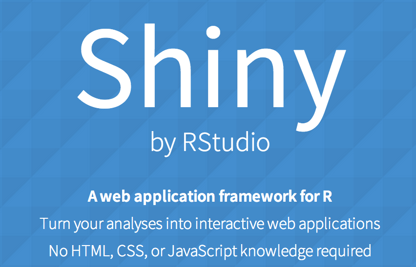
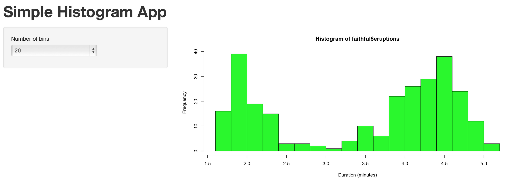
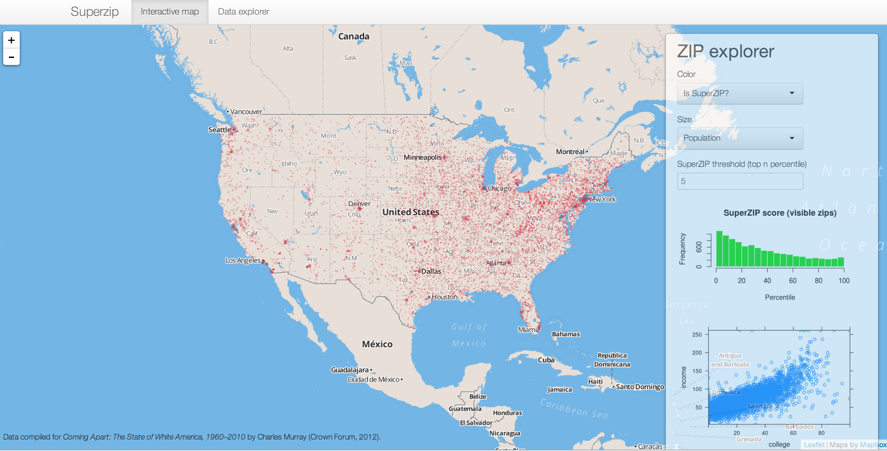
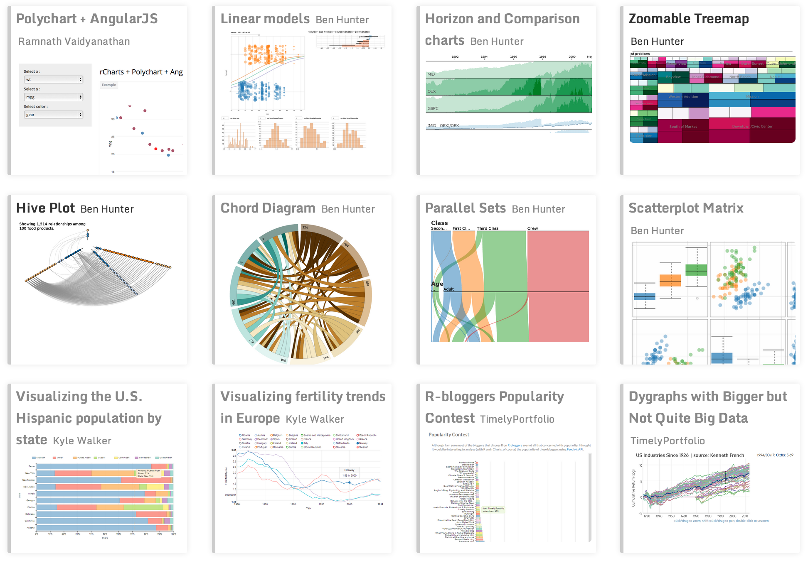
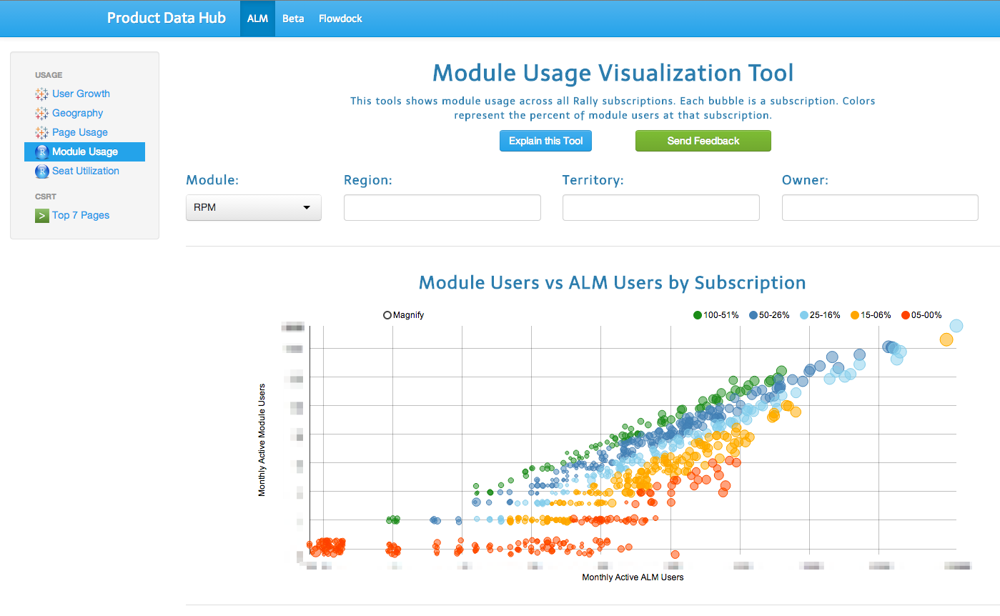
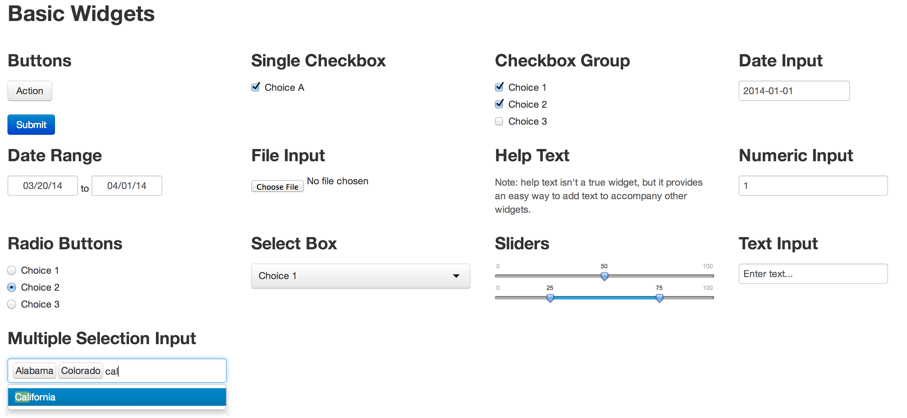
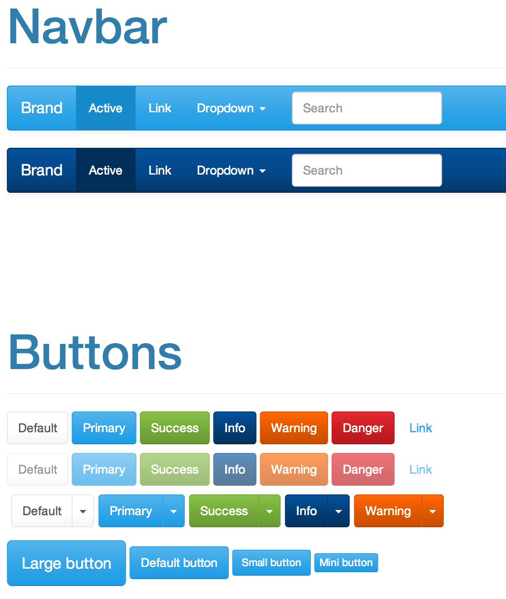

## A D3 chart
<iframe src='
assets/fig/unnamed-chunk-1.html
' scrolling='no' seamless class='rChart 
nvd3
 '
id=iframe-
chart30d150a4c510
></iframe>
<style>iframe.rChart{ width: 100%; height: 400px;}</style>

--- &radio
## Quiz

How many lines of code did I write to make this chart?

1. _1_
2. 10
3. 100
4. 1000

*** .hint
I used R not javascript/html/css

*** .explanation
```s
n1 <- nPlot(y ~ x, group = , data = , type =)
```

---
## About Me
- Mech Engr -> Building Energy Researcher -> Data Scientist
- Product Data Scientist at Rally Software
- Love exploring tools and techniques

---
## Who is Rally?


---
## How I work with teams
- I focus on product usage
- Data engineers and programmes
- Product owners and Developer teams
- Sales and Enablement teams

---
## Goal for Presentation
- I want to share everything I have learned with you
- 1 year of making shiny work in business
- I have figured out many small things that make it powerful
- Take it, Learn it, Change it, Improve it

---
## Outline
 - Tool Overview
 - Business value 
 - Demo
 - Steps to make a shiny app
 - Code chunks

--- .segue bg:blue

## Tool Overview

--- .segue bg:orange

## What is Shiny?

---
## Shiny 
http://shiny.rstudio.com/



---
## Simple Shiny App


---
## ui.R

```r
shinyUI(pageWithSidebar(
  headerPanel("Simple Histogram App"),
  sidebarPanel(
    selectInput(inputId = "n_bins",
                label = "Number of bins",
                choices = c(10, 20, 25, 30, 50),
                selected = 20
                )
  ),
  mainPanel(
    plotOutput(outputId = "main_plot")
  )
))
```

---
## server.r

```r
shinyServer(function(input,output){

  output$main_plot <- renderPlot({  
    hist(faithful$eruptions,
         breaks = as.numeric(input$n_bins),
         col = "green",
         xlab = "Duration (minutes)")  
  })
})
```

---
## Advanced Shiny App



---
## Check out more examples
http://shiny.rstudio.com/gallery/


--- .segue bg:orange
## What is rCharts? 

---
## rChart

<iframe src='
assets/fig/unnamed-chunk-2.html
' scrolling='no' seamless class='rChart 
nvd3
 '
id=iframe-
chart30d1d91ce94
></iframe>
<style>iframe.rChart{ width: 100%; height: 400px;}</style>

---
## rChart code


```r
require(rCharts)
require(knitr)
haireye = as.data.frame(HairEyeColor)
n1 <- nPlot(Freq ~ Hair, 
  group = 'Eye',
  data = subset(haireye, Sex == 'Male'),
  type = 'multiBarChart'
)
n1
```

---
## Shiny and rChart


---
## More rChart examples
http://rcharts.io/gallery/



--- .segue bg:blue
## Business Value

---
## Product Data Hub


---
## Product Data Hub
- Built with R using Shiny and rCharts
- Interactive analysis and charts
- Embed other dashboard here also
- Serves many teams in Product and Sales

---
## Top 3 Reasons for Shiny
* Interactive - Individuals can easily slice and dice data
* Removes interrupts - Don't have to re-run and re-share analysis. 
* Cheap - Free to build and share

---
## More Reasons for Shiny

* Customizable - Pick your colors and style and layout
* Simple - One place to see everything that matters
* Extensible - Web functionality (navigation, modals, styles)

---
## Top 3 Reasons for rCharts
- Tooltips - Answers the next questions
- Beautiful - Looks great and D3 is amazing
- Density - Change the view right there

---
## More Reasons for rCharts
- Simple - Don't need to write 3 languages 
  - html, css, javascript
- Unique - There are charts that no other library can make
- Presentation - Sharing is such a key part of the data flow  


--- .segue bg:blue

## Demo

---
## Github Hot or Not Shiny App
http://surlyanalytics.shinyapps.io/github_hot_or_not/
  


---
## App repo
 - https://github.com/wsurles/github_hot_or_not
 - Learn how to code this app
 - Help me make it better.
 - Thanks!

---
## Shiny workshop
  - https://github.com/wsurles/shiny_workshop/tree/advanced
  - Build 3 apps self paced
  - Progressively more powerful
  - The steps are smooth. It has been tested.

--- .segue bg:blue

## Steps to make a shiny app

---
## Add inputs
http://shiny.rstudio.com/gallery/widgets-gallery.html



---
## Build charts and tables
http://shiny.rstudio.com/reference/shiny/latest/


--- 
## Add navigation
http://shiny.rstudio.com/reference/shiny/latest/


---
## Chose a theme
http://bootswatch.com/



--- 
## Embed other pages

```s
tabPanel("tableau", includeHTML("tableau_dashboard.html"), align = 'center')
```


--- .segue bg:blue

## Code Chunks

---
## R structure 
### Use functions

```s
output$plot_github <- renderChart2({    
  
  df <- chooseLang()
  df2 <- crunchDataGithub(df)
  df3 <- filterGithub()
  color <- setColorGithub(df2,df3)
  n <- createPlotGithub(df3, color)  
  
})
```

---
## Dynamic UI elements 
### Build ui elements in server.R

```s
output$repo_owner <- renderUI({
  
  df <- chooseLang()
  df2 <- crunchDataGithub(df)
  owner_list <- sort(unique(df2$repository_owner))
  
  selectizeInput(inputId = "owner",
                 label = h4("Owner:"),
                 choices = owner_list,
                 multiple = TRUE)
})
```

--- 
## Scatter Chart 

```s
createPlotGithub <- function(df2, color) {

  df3 <- select(df2, repository_watchers, age_days, watch_group, log_forks, 
                     repository_name, watch_per_day, repository_owner, 
                     repository_forks, date_created_str)

  p <- nPlot(repository_watchers ~ age_days, 
              group = 'watch_group', 
              data = df3, 
              type = 'scatterChart')
  p$yAxis(axisLabel = 'Stars')
  p$xAxis(axisLabel = 'Age in Days')
  p$chart(color = color)
  p$chart(size = '#! function(d){return d.log_forks} !#')
  
  return(p)

}
```

---
## Tooltip

```s
p$chart(tooltipContent = "#!
          function(key, x, y, d){ 
            return '<h3>' + d.point.repository_name + '</h3>' +
            '<p> <b>' +  d.point.watch_per_day + ' Stars/Day' + '</b> </p>' +
            '<p> Owner = ' +  d.point.repository_owner + '</p>' +
            '<p> Age in Days = ' +  d.point.age_days + '</p>' +                    
            '<p> Stars = ' +  d.point.repository_watchers + '</p>' +          
            '<p> Forks = ' +  d.point.repository_forks + '</p>' +       
            '<p> Date Created = ' +  d.point.date_created_str + '</p>'
          }
          !#")
```

---
## Add javascript

```s
createButtonLink <- function(link, text) {
  sprintf('
      <a class="mcnButton" 
      href="%s" 
      target="_blank" 
      style="font-weight: normal;
             background-color: #337EC6;
             ...  
             color: #FFFFFF;
             word-wrap: break-word !important; 
             font-family:Arial;"
             >%s</button>
             ',link, text)
}
```

---
## Add css and style

```s
shinyUI(
  
  navbarPage(
  
    id = "nbp",
    title = "Data Hub", 
    theme = "bootstrap.css",
    ...
```

---
## Resources and References

Shiny http://shiny.rstudio.com/

Shiny tutorial https://github.com/wsurles/shiny_workshop

rCharts http://rcharts.io/

Slidify http://slidify.github.io/

Slidify example http://slidify.github.io/dcmeetup/#1


